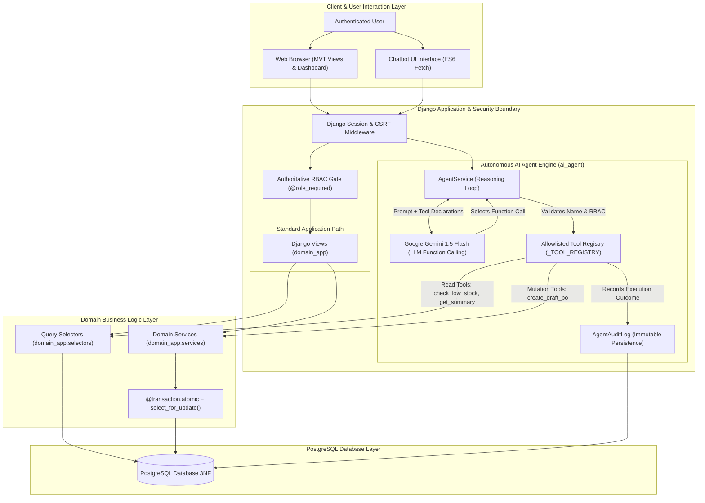

# System Architecture Specification
## Small Business Inventory & Sales Management System (NexusERP)

---

## 1. Architectural Style & Philosophy

NexusERP is constructed as a **modular, monolithic Model-View-Template (MVT)** enterprise application using **Python 3.12** and **Django 5.1**.

### Architectural Principles:
1. **Clean Separation of Concerns:**
   - **Views (`views.py`):** Responsible strictly for HTTP protocol negotiation, request validation, form binding, and rendering templates or JSON responses.
   - **Selectors (`selectors.py`):** Encapsulate all database read operations, complex query filters, prefetching, and aggregations. Views never build complex query filters directly.
   - **Services (`services.py`):** Encapsulate all database mutations, business rule enforcement, row locking, and atomic boundaries.
2. **Authoritative Server-Side Security:**
   - Client-side role claims or UI controls are untrusted.
   - Authorization is enforced by decorators (`@admin_required`, `@manager_required`, `@login_required`) and service-level permission checks.
3. **Strict Concurrency Safety:**
   - Row-level database locks (`select_for_update()`) serialize concurrent stock decrements, receiving operations, and status advancements.
4. **Controlled AI Tool Execution:**
   - The AI Agent acts as an orchestration client that interacts with the backend *only* through registered, allowlisted tool functions.
   - **The AI has ZERO direct access to the database or SQL engine.**

---

## 2. High-Level System Architecture Diagram

```
┌────────────────────────────────────────────────────────────────────────┐
│                          CLIENT / BROWSER                              │
│          HTML5 / Vanilla Modern CSS / ES6+ Fetch API (CSRF)            │
└───────────────────────────────────┬────────────────────────────────────┘
                                    │ HTTP Requests
                                    ▼
┌────────────────────────────────────────────────────────────────────────┐
│                        DJANGO MVT WEB LAYER                            │
│                                                                        │
│  ┌───────────────────────┐             ┌────────────────────────────┐  │
│  │   apps/core (Static)  │             │ apps/authentication (RBAC) │  │
│  └───────────────────────┘             └────────────────────────────┘  │
│  ┌──────────────────────────────────────────────────────────────────┐  │
│  │                     apps/domain_app (Views)                      │  │
│  │   - Product, Category, Supplier, Inventory, Sales, PO Views      │  │
│  └──────────────────┬───────────────────────────────┬───────────────┘  │
│                     │                               │                  │
│        Delegates    │                               │  Delegates       │
│        Mutations    │                               │  Queries         │
│                     ▼                               ▼                  │
│  ┌───────────────────────────────────┐  ┌───────────────────────────┐  │
│  │     apps/domain_app/services      │  │ apps/domain_app/selectors │  │
│  │  - @transaction.atomic            │  │ - select_related() (N+1)  │  │
│  │  - select_for_update() row locks  │  │ - prefetch_related()      │  │
│  │  - Check constraint assertions    │  │ - O(1) DB Aggregations    │  │
│  └──────────────────┬────────────────┘  └─────────────┬─────────────┘  │
└─────────────────────┼─────────────────────────────────┼────────────────┘
                      │                                 │
                      │       PostgreSQL Engine         │
                      └────────────────►◄───────────────┘
                                        │
                                        ▼
                      ┌─────────────────────────────────┐
                      │    PostgreSQL Database (3NF)    │
                      │  Tables, Constraints, Indexes   │
                      └─────────────────────────────────┘
```

---

## 3. Dual-Track Architecture: User Flow vs. AI Agent Flow

The following diagram demonstrates the separation between traditional user requests and the sandboxed Agentic AI workflow:



---

## 4. Architectural Isolation: The AI Sandboxing Boundary

> [!IMPORTANT]
> **CRITICAL SECURITY GUARANTEE:**
> The Large Language Model (Gemini) has **ZERO direct access** to PostgreSQL. It cannot execute SQL queries, execute shell commands, read the filesystem, or import Python modules.

### Security Boundary Comparison:

```
[WHAT THE LLM CANNOT DO]
─────────────────────────────────────────────────────────────────
  LLM ───X───► Raw SQL Execution (No raw queries permitted)
  LLM ───X───► Direct Database Connections (No connection pool access)
  LLM ───X───► Arbitrary Code Execution (No eval, exec, os.system)
  LLM ───X───► Bypassing Django RBAC (Inherits caller's role)
  LLM ───X───► Unconfirmed Mutations (Sensitive tools require human confirmation)

[WHAT THE LLM ACTUALLY DOES]
─────────────────────────────────────────────────────────────────
  LLM ───► Emits Structured JSON function_call:
             {
               "name": "check_low_stock_products",
               "args": {"limit": 10}
             }
             │
             ▼
  Backend AI Engine intercepts call:
  1. Validates function name is in allowlist
  2. Binds server-side request.user identity
  3. Evaluates can_user_execute_tool(user, tool_name)
  4. Calls domain_app.selectors or domain_app.services
  5. Masks sensitive keys and writes AgentAuditLog
  6. Returns structured JSON dictionary to LLM
```

---

## 5. Concurrency & Transaction Management

NexusERP guarantees data consistency under concurrent load using explicit transactional primitives:

### 1. Row-Level Concurrency Locking (`select_for_update()`)
- When a customer purchases items via `services.create_sale()`, all requested product rows are locked immediately:
  ```python
  locked_products_qs = Product.objects.select_for_update().filter(pk__in=product_ids)
  ```
- Concurrent sales transactions attempting to decrement the same SKU are serialized.
- Prevents race conditions and guarantees that stock never drops below zero ($0$).

### 2. Purchase Order Status Advancements
- Advancing a purchase order from `APPROVED` to `RECEIVED` locks the purchase order row and all target product rows simultaneously.
- Increments physical stock atomically and writes corresponding `InventoryTransaction` rows in the same transaction block.

### 3. ACID Rollbacks
- If any validation failure occurs mid-transaction (e.g., an inactive product is encountered, or a credit validation fails), the entire atomic transaction block rolls back, leaving no orphaned headers or corrupted stock balances.

---

## 6. Directory and Module Organization

```
smart-inventory-sales-agent/
├── apps/
│   ├── authentication/          # User identity, RBAC decorators, profiles, dashboard
│   │   ├── models.py            # Custom User model (ADMIN, MANAGER, STANDARD)
│   │   ├── permissions.py       # RBAC decorators (@admin_required, @manager_required)
│   │   ├── views.py             # Auth, profile, dashboard controllers
│   │   └── urls.py              # /auth/* routes
│   │
│   ├── domain_app/              # Core business domain models, services, selectors
│   │   ├── models.py            # Category, Supplier, Product, Sale, PO, InventoryTransaction
│   │   ├── selectors.py         # N+1 safe queries, KPI aggregations, low-stock reports
│   │   ├── services.py          # Atomic mutations, stock decrements, PO receiving
│   │   ├── views.py             # Catalog, inventory, sales, and PO views
│   │   └── urls.py              # /domain/* routes
│   │
│   ├── ai_agent/                # Sandboxed Agentic AI workflow
│   │   ├── models.py            # AgentAuditLog persistence model
│   │   ├── prompts.py           # Hardened system instructions & prompt evolution log
│   │   ├── tool_registry.py     # Central registry & dispatch gateway
│   │   ├── agent_tools.py       # Callable tool implementations & parameter schemas
│   │   ├── tools.py             # Gemini FunctionDeclarations, RBAC checks, sanitization
│   │   ├── services.py          # Multi-step Agent reasoning-action loop
│   │   ├── views.py             # Chatbot UI controller & JSON streaming endpoints
│   │   └── urls.py              # /ai/* routes
│   │
│   └── core/                    # Core layouts, base navigation, shared utilities
│
├── config/                      # Root configuration & settings
│   ├── settings.py              # Multi-environment settings (PostgreSQL / SQLite)
│   └── urls.py                  # Master routing configuration
│
├── docs/                        # Graduation Project Deliverables & Defense Manuals
│   ├── SRS.md                   # Official Software Requirements Specification
│   ├── ERD.md                   # Entity-Relationship Diagram & Data Dictionary
│   ├── ARCHITECTURE.md          # System Architecture & AI Sandboxing Boundary
│   ├── USER_JOURNEYS.md         # Visual Step-by-Step User Workflows
│   └── AI_AGENT_DESIGN.md       # AI Tool Specifications, Loop & Safety Protocols
│
├── static/                      # CSS stylesheets, ES6 client scripts, brand imagery
├── templates/                   # Semantic HTML5 templates
└── manage.py                    # Django management runner
```
