# Entity-Relationship Diagram (ERD) & Data Dictionary
## Small Business Inventory & Sales Management System (NexusERP)

---

## 1. System ERD Overview

The NexusERP database architecture is designed in **Third Normal Form (3NF)** on PostgreSQL. The schema consists of 10 primary models organized into three cohesive domain apps:
- **Authentication App:** `User`
- **Domain App:** `Category`, `Supplier`, `Product`, `InventoryTransaction`, `Sale`, `SaleItem`, `PurchaseOrder`, `PurchaseOrderItem`
- **AI Agent App:** `AgentAuditLog`

---

## 2. Visual Entity-Relationship Diagram (Mermaid)

```mermaid
erDiagram
    %% Relationships with precise cardinality and deletion semantics
    User ||--o{ InventoryTransaction : "authorizes (SET_NULL)"
    User ||--o{ Sale : "creates (SET_NULL)"
    User ||--o{ PurchaseOrder : "creates (SET_NULL)"
    User ||--o{ AgentAuditLog : "initiates (CASCADE)"

    Category ||--o{ Product : "classifies (PROTECT)"
    Supplier ||--o{ Product : "furnishes (SET_NULL)"
    Supplier ||--o{ PurchaseOrder : "fulfills (PROTECT)"

    Product ||--o{ InventoryTransaction : "tracks (PROTECT)"
    Product ||--o{ SaleItem : "purchased_in (PROTECT)"
    Product ||--o{ PurchaseOrderItem : "replenished_in (PROTECT)"

    Sale ||--|{ SaleItem : "contains (CASCADE)"
    PurchaseOrder ||--|{ PurchaseOrderItem : "contains (CASCADE)"

    %% Entity Declarations
    User {
        bigint id PK "Auto-incrementing primary key"
        varchar username UK "Unique system username"
        varchar email UK "Unique email address"
        varchar password "PBKDF2 SHA-256 hashed password"
        varchar role "ADMIN | MANAGER | STANDARD"
        varchar phone_number "Contact telephone"
        text bio "Profile biography"
        boolean is_active "Active account flag"
        boolean is_staff "Staff administrative flag"
        boolean is_superuser "Root superuser flag"
        timestamp date_joined "Account creation date"
        timestamp created_at "Record created timestamp"
        timestamp updated_at "Record modified timestamp"
    }

    Category {
        bigint id PK "Auto-incrementing primary key"
        varchar name UK "Unique classification name"
        varchar slug UK "URL-safe unique slug"
        text description "Detailed category overview"
        boolean is_active "Visible for assignment flag"
        timestamp created_at "Record created timestamp"
        timestamp updated_at "Record modified timestamp"
    }

    Supplier {
        bigint id PK "Auto-incrementing primary key"
        varchar name "Supplier company name (indexed)"
        varchar contact_person "Primary representative"
        varchar email "Procurement email (indexed)"
        varchar phone "Direct telephone"
        text address "Physical dispatch/office address"
        boolean is_active "Operational active flag (indexed)"
        timestamp created_at "Record created timestamp"
        timestamp updated_at "Record modified timestamp"
    }

    Product {
        bigint id PK "Auto-incrementing primary key"
        varchar sku UK "Globally unique SKU (indexed)"
        varchar name "Commercial product name (indexed)"
        text description "Product specifications"
        bigint category_id FK "FK to Category (PROTECT)"
        bigint supplier_id FK "FK to Supplier (SET_NULL, nullable)"
        numeric price "Unit selling price (gte 0.00)"
        integer stock_quantity "Physical units on hand (gte 0)"
        integer reorder_level "Low-stock threshold (gte 0)"
        integer target_stock_level "Replenishment target (nullable)"
        boolean is_active "Available for operations flag"
        timestamp created_at "Record created timestamp (indexed)"
        timestamp updated_at "Record modified timestamp"
    }

    InventoryTransaction {
        bigint id PK "Auto-incrementing primary key"
        bigint product_id FK "FK to Product (PROTECT)"
        varchar transaction_type "ADD | REMOVE | ADJUSTMENT"
        integer quantity "Units moved or adjusted delta (gte 0)"
        integer previous_stock "Pre-transaction snapshot (gte 0)"
        integer new_stock "Post-transaction snapshot (gte 0)"
        varchar reference "Sale/PO identifier or audit code"
        text notes "Operational explanation"
        bigint created_by_id FK "FK to User (SET_NULL, nullable)"
        timestamp created_at "Committed timestamp (indexed)"
    }

    Sale {
        bigint id PK "Auto-incrementing primary key"
        varchar order_identifier UK "Unique tracking ID (SALE-YYYYMMDD-XXXXXX)"
        varchar customer_name "Customer full name (indexed)"
        varchar customer_email "Customer email address"
        varchar customer_phone "Customer telephone"
        timestamp sale_date "Operational execution timestamp (indexed)"
        varchar status "COMPLETED | DRAFT | CANCELLED"
        numeric total_amount "Backend-calculated order sum (gte 0.00)"
        text notes "Commercial or shipping notes"
        bigint created_by_id FK "FK to User (SET_NULL, nullable)"
        timestamp created_at "Record created timestamp (indexed)"
        timestamp updated_at "Record modified timestamp"
    }

    SaleItem {
        bigint id PK "Auto-incrementing primary key"
        bigint sale_id FK "FK to Sale (CASCADE)"
        bigint product_id FK "FK to Product (PROTECT)"
        integer quantity "Units purchased (gt 0)"
        numeric unit_price "Historical price snapshot (gte 0.00)"
        numeric subtotal "Line total: quantity * unit_price (gte 0.00)"
        timestamp created_at "Record created timestamp"
    }

    PurchaseOrder {
        bigint id PK "Auto-incrementing primary key"
        varchar order_number UK "Unique tracking ID (PO-YYYYMMDD-XXXX)"
        bigint supplier_id FK "FK to Supplier (PROTECT)"
        varchar status "DRAFT | PENDING | APPROVED | RECEIVED | CANCELLED"
        timestamp order_date "Order issue timestamp (indexed)"
        numeric total_amount "Backend-calculated order sum (gte 0.00)"
        text notes "Procurement instructions"
        bigint created_by_id FK "FK to User (SET_NULL, nullable)"
        timestamp created_at "Record created timestamp (indexed)"
        timestamp updated_at "Record modified timestamp"
    }

    PurchaseOrderItem {
        bigint id PK "Auto-incrementing primary key"
        bigint purchase_order_id FK "FK to PurchaseOrder (CASCADE)"
        bigint product_id FK "FK to Product (PROTECT)"
        integer quantity "Units to purchase (gt 0)"
        numeric unit_cost "Agreed unit cost (gte 0.00)"
        numeric subtotal "Line total: quantity * unit_cost (gte 0.00)"
    }

    AgentAuditLog {
        bigint id PK "Auto-incrementing primary key"
        bigint user_id FK "FK to User (CASCADE, nullable)"
        varchar tool_name "Registered tool invoked (indexed)"
        jsonb parameters "Sanitized execution parameters"
        varchar status "SUCCESS | DENIED | FAILED"
        text response_summary "Execution summary or error detail"
        timestamp created_at "Committed timestamp (indexed)"
    }
```

---

## 3. Detailed Data Dictionary

### 3.1 `authentication_user` (`User`)
Custom user model extending `AbstractUser` providing role-based security boundaries.

| Field Name | PostgreSQL Type | Nullable | Key / Constraint | Business & Validation Rules |
| :--- | :--- | :---: | :---: | :--- |
| `id` | `BIGSERIAL` | No | **PK** | Surrogate auto-incrementing identifier. |
| `username` | `VARCHAR(150)` | No | **UNIQUE** | System login username. |
| `email` | `VARCHAR(254)` | No | **UNIQUE** | Unique user contact and login email. |
| `password` | `VARCHAR(128)` | No | - | Salted hash (Django PBKDF2 SHA-256). |
| `role` | `VARCHAR(20)` | No | Indexed | Choice: `ADMIN`, `MANAGER`, `STANDARD`. Defaults to `STANDARD`. |
| `phone_number` | `VARCHAR(25)` | Yes | - | Contact phone number. |
| `bio` | `TEXT` | Yes | - | User bio, max 500 characters. |
| `is_active` | `BOOLEAN` | No | - | Designates if account is enabled. |
| `is_staff` | `BOOLEAN` | No | - | Automatically synchronized with `role == ADMIN`. |
| `is_superuser`| `BOOLEAN` | No | - | Grants all permissions. Aligns role to `ADMIN`. |
| `created_at` | `TIMESTAMPTZ` | No | - | Auto-generated timestamp on user creation. |
| `updated_at` | `TIMESTAMPTZ` | No | - | Auto-updated timestamp on modification. |

---

### 3.2 `domain_app_category` (`Category`)
Taxonomy classification grouping inventory products.

| Field Name | PostgreSQL Type | Nullable | Key / Constraint | Business & Validation Rules |
| :--- | :--- | :---: | :---: | :--- |
| `id` | `BIGSERIAL` | No | **PK** | Surrogate auto-incrementing identifier. |
| `name` | `VARCHAR(100)` | No | **UNIQUE** | Name of category. Check: `name != ''`. |
| `slug` | `VARCHAR(120)` | No | **UNIQUE** | URL-safe slug auto-generated from `name`. |
| `description`| `TEXT` | Yes | - | Detailed description. |
| `is_active` | `BOOLEAN` | No | Indexed | Category active status. |
| `created_at` | `TIMESTAMPTZ` | No | - | Timestamp upon record creation. |
| `updated_at` | `TIMESTAMPTZ` | No | - | Timestamp upon modification. |

- **Indexes:** `idx_cat_name_active` on `(name, is_active)`
- **Check Constraints:** `check_category_name_not_empty` (`name != ''`)

---

### 3.3 `domain_app_supplier` (`Supplier`)
Commercial vendor furnishing inventory products.

| Field Name | PostgreSQL Type | Nullable | Key / Constraint | Business & Validation Rules |
| :--- | :--- | :---: | :---: | :--- |
| `id` | `BIGSERIAL` | No | **PK** | Surrogate auto-incrementing identifier. |
| `name` | `VARCHAR(200)` | No | Indexed | Official company name. Check: `name != ''`. |
| `contact_person`| `VARCHAR(150)`| Yes | - | Primary representative name. |
| `email` | `VARCHAR(254)` | No | Indexed | Validated supplier contact email. |
| `phone` | `VARCHAR(50)` | No | - | Direct telephone contact. |
| `address` | `TEXT` | Yes | - | Warehouse or office dispatch address. |
| `is_active` | `BOOLEAN` | No | Indexed | Flag indicating if supplier can receive orders. |
| `created_at` | `TIMESTAMPTZ` | No | - | Timestamp upon record creation. |
| `updated_at` | `TIMESTAMPTZ` | No | - | Timestamp upon modification. |

- **Indexes:** `idx_supplier_name` (`name`), `idx_supplier_email` (`email`), `idx_supplier_name_active` (`name, is_active`)
- **Check Constraints:** `check_supplier_name_not_empty` (`name != ''`)

---

### 3.4 `domain_app_product` (`Product`)
Individual inventory SKU catalog record.

| Field Name | PostgreSQL Type | Nullable | Key / Constraint | Business & Validation Rules |
| :--- | :--- | :---: | :---: | :--- |
| `id` | `BIGSERIAL` | No | **PK** | Surrogate auto-incrementing identifier. |
| `sku` | `VARCHAR(64)` | No | **UNIQUE** | Globally unique SKU code (normalized uppercase). |
| `name` | `VARCHAR(200)` | No | Indexed | Commercial product display name. |
| `description`| `TEXT` | Yes | - | Technical or commercial product specifications. |
| `category_id`| `BIGINT` | No | **FK (PROTECT)** | References `domain_app_category.id`. Cannot delete parent category. |
| `supplier_id`| `BIGINT` | Yes | **FK (SET_NULL)**| References `domain_app_supplier.id`. Nullified on supplier deletion. |
| `price` | `NUMERIC(12,2)` | No | Check Constraint | Unit selling price. Must be $\ge 0.00$. |
| `stock_quantity`| `INTEGER` | No | Check Constraint | Current physical units on hand. Must be $\ge 0$. |
| `reorder_level`| `INTEGER` | No | Check Constraint | Reorder alert threshold. Must be $\ge 0$. Default: 10. |
| `target_stock_level`| `INTEGER` | Yes | Check Constraint | Optional replenishment maximum. Must be $\ge 0$. |
| `is_active` | `BOOLEAN` | No | Indexed | Catalog visibility flag. |
| `created_at` | `TIMESTAMPTZ` | No | Indexed | Creation timestamp. |
| `updated_at` | `TIMESTAMPTZ` | No | - | Last modification timestamp. |

- **Indexes:** `idx_prod_cat_active`, `idx_prod_supplier`, `idx_prod_name`, `idx_prod_sku`, `idx_prod_created_at`
- **Check Constraints:**
  - `check_product_price_non_negative`: `price >= 0.00`
  - `check_product_stock_non_negative`: `stock_quantity >= 0`
  - `check_product_reorder_non_negative`: `reorder_level >= 0`
  - `check_product_target_stock_non_negative`: `target_stock_level IS NULL OR target_stock_level >= 0`
  - `check_product_sku_not_empty`: `sku != ''`

---

### 3.5 `domain_app_inventorytransaction` (`InventoryTransaction`)
Immutable audit ledger capturing all physical stock balance mutations.

| Field Name | PostgreSQL Type | Nullable | Key / Constraint | Business & Validation Rules |
| :--- | :--- | :---: | :---: | :--- |
| `id` | `BIGSERIAL` | No | **PK** | Surrogate auto-incrementing identifier. |
| `product_id` | `BIGINT` | No | **FK (PROTECT)** | References `domain_app_product.id`. |
| `transaction_type`| `VARCHAR(20)`| No | Indexed | Choice: `ADD`, `REMOVE`, `ADJUSTMENT`. |
| `quantity` | `INTEGER` | No | Check Constraint | Movement units count. Must be $\ge 0$. |
| `previous_stock`| `INTEGER` | No | Check Constraint | Stock immediately prior to transaction ($\ge 0$). |
| `new_stock` | `INTEGER` | No | Check Constraint | Stock immediately following transaction ($\ge 0$). |
| `reference` | `VARCHAR(100)` | Yes | - | Sale ID, PO number, or adjustment tag. |
| `notes` | `TEXT` | Yes | - | Audit reason or operational explanation. |
| `created_by_id`| `BIGINT` | Yes | **FK (SET_NULL)**| References `authentication_user.id`. Authorized staff user. |
| `created_at` | `TIMESTAMPTZ` | No | Indexed | Transaction execution timestamp. |

- **Indexes:** `idx_inv_tx_prod_date`, `idx_inv_tx_type_date`, `idx_inv_tx_created`
- **Check Constraints:**
  - `check_inv_tx_qty_non_negative`: `quantity >= 0`
  - `check_inv_tx_prev_non_neg`: `previous_stock >= 0`
  - `check_inv_tx_new_non_neg`: `new_stock >= 0`

---

### 3.6 `domain_app_sale` (`Sale`)
Commercial customer sale order transaction header.

| Field Name | PostgreSQL Type | Nullable | Key / Constraint | Business & Validation Rules |
| :--- | :--- | :---: | :---: | :--- |
| `id` | `BIGSERIAL` | No | **PK** | Surrogate auto-incrementing identifier. |
| `order_identifier`| `VARCHAR(64)`| No | **UNIQUE** | Unique identifier (`SALE-YYYYMMDD-XXXXXX`). Check: not empty. |
| `customer_name`| `VARCHAR(200)` | No | Indexed | Customer or business name. Check: not empty. |
| `customer_email`| `VARCHAR(254)`| Yes | - | Optional customer email address. |
| `customer_phone`| `VARCHAR(50)` | Yes | - | Optional customer phone number. |
| `sale_date` | `TIMESTAMPTZ` | No | Indexed | Operational transaction execution timestamp. |
| `status` | `VARCHAR(20)` | No | Indexed | Choice: `COMPLETED`, `DRAFT`, `CANCELLED`. Default: `COMPLETED`. |
| `total_amount`| `NUMERIC(12,2)` | No | Check Constraint | Backend-aggregated order subtotal ($\ge 0.00$). |
| `notes` | `TEXT` | Yes | - | Commercial context or shipping instructions. |
| `created_by_id`| `BIGINT` | Yes | **FK (SET_NULL)**| References `authentication_user.id`. Processing staff member. |
| `created_at` | `TIMESTAMPTZ` | No | Indexed | Record creation timestamp. |
| `updated_at` | `TIMESTAMPTZ` | No | - | Record modification timestamp. |

- **Indexes:** `idx_sale_order_id`, `idx_sale_date`, `idx_sale_status`, `idx_sale_cust_name`, `idx_sale_created_at`, `idx_sale_status_date`
- **Check Constraints:**
  - `check_sale_total_amount_non_negative`: `total_amount >= 0.00`
  - `check_sale_order_id_not_empty`: `order_identifier != ''`
  - `check_sale_customer_name_not_empty`: `customer_name != ''`

---

### 3.7 `domain_app_saleitem` (`SaleItem`)
Individual line item mapping a purchased product to a sale order.

| Field Name | PostgreSQL Type | Nullable | Key / Constraint | Business & Validation Rules |
| :--- | :--- | :---: | :---: | :--- |
| `id` | `BIGSERIAL` | No | **PK** | Surrogate auto-incrementing identifier. |
| `sale_id` | `BIGINT` | No | **FK (CASCADE)** | References `domain_app_sale.id`. Deleted with parent sale. |
| `product_id` | `BIGINT` | No | **FK (PROTECT)** | References `domain_app_product.id`. Cannot delete purchased SKU. |
| `quantity` | `INTEGER` | No | Check Constraint | Units purchased. Must be $> 0$. |
| `unit_price` | `NUMERIC(12,2)` | No | Check Constraint | Frozen unit price snapshot at time of sale ($\ge 0.00$). |
| `subtotal` | `NUMERIC(12,2)` | No | Check Constraint | Line total: $\text{quantity} \times \text{unit\_price}$ ($\ge 0.00$). |
| `created_at` | `TIMESTAMPTZ` | No | - | Record creation timestamp. |

- **Unique Constraints:** `unique_product_per_sale` on `(sale, product)` prevents duplicate lines.
- **Indexes:** `idx_sale_item_sale_prod`, `idx_sale_item_prod`
- **Check Constraints:**
  - `check_sale_item_qty_positive`: `quantity > 0`
  - `check_sale_item_unit_price_non_neg`: `unit_price >= 0.00`
  - `check_sale_item_subtotal_non_neg`: `subtotal >= 0.00`

---

### 3.8 `domain_app_purchaseorder` (`PurchaseOrder`)
Commercial replenishment purchase order header.

| Field Name | PostgreSQL Type | Nullable | Key / Constraint | Business & Validation Rules |
| :--- | :--- | :---: | :---: | :--- |
| `id` | `BIGSERIAL` | No | **PK** | Surrogate auto-incrementing identifier. |
| `order_number`| `VARCHAR(64)` | No | **UNIQUE** | Unique identifier (`PO-YYYYMMDD-XXXX`). Check: not empty. |
| `supplier_id`| `BIGINT` | No | **FK (PROTECT)** | References `domain_app_supplier.id`. Vendor fulfilling PO. |
| `status` | `VARCHAR(20)` | No | Indexed | Choice: `DRAFT`, `PENDING`, `APPROVED`, `RECEIVED`, `CANCELLED`. |
| `order_date` | `TIMESTAMPTZ` | No | Indexed | Date and time order was issued. |
| `total_amount`| `NUMERIC(12,2)` | No | Check Constraint | Backend-aggregated PO cost ($\ge 0.00$). |
| `notes` | `TEXT` | Yes | - | Special vendor instructions or cancellation reasons. |
| `created_by_id`| `BIGINT` | Yes | **FK (SET_NULL)**| References `authentication_user.id`. Authorizing user. |
| `created_at` | `TIMESTAMPTZ` | No | Indexed | Record creation timestamp. |
| `updated_at` | `TIMESTAMPTZ` | No | - | Record modification timestamp. |

- **Indexes:** `idx_po_order_number`, `idx_po_order_date`, `idx_po_status`, `idx_po_created_at`, `idx_po_supplier_date`
- **Check Constraints:**
  - `check_po_total_amount_non_negative`: `total_amount >= 0.00`
  - `check_po_order_number_not_empty`: `order_number != ''`

---

### 3.9 `domain_app_purchaseorderitem` (`PurchaseOrderItem`)
Individual line item mapping a replenishment SKU to a purchase order.

| Field Name | PostgreSQL Type | Nullable | Key / Constraint | Business & Validation Rules |
| :--- | :--- | :---: | :---: | :--- |
| `id` | `BIGSERIAL` | No | **PK** | Surrogate auto-incrementing identifier. |
| `purchase_order_id`| `BIGINT` | No | **FK (CASCADE)** | References `domain_app_purchaseorder.id`. Deleted with parent PO. |
| `product_id` | `BIGINT` | No | **FK (PROTECT)** | References `domain_app_product.id`. SKU being purchased. |
| `quantity` | `INTEGER` | No | Check Constraint | Units ordered. Must be $> 0$. |
| `unit_cost` | `NUMERIC(12,2)` | No | Check Constraint | Agreed unit cost ($\ge 0.00$). |
| `subtotal` | `NUMERIC(12,2)` | No | Check Constraint | Line total: $\text{quantity} \times \text{unit\_cost}$ ($\ge 0.00$). |

- **Unique Constraints:** `unique_product_per_po` on `(purchase_order, product)` prevents duplicate lines.
- **Indexes:** `idx_po_item_po_prod`, `idx_po_item_prod`
- **Check Constraints:**
  - `check_po_item_qty_positive`: `quantity > 0`
  - `check_po_item_unit_cost_non_neg`: `unit_cost >= 0.00`
  - `check_po_item_subtotal_non_neg`: `subtotal >= 0.00`

---

### 3.10 `ai_agent_agentauditlog` (`AgentAuditLog`)
Immutable audit trail for all AI Agent tool invocations.

| Field Name | PostgreSQL Type | Nullable | Key / Constraint | Business & Validation Rules |
| :--- | :--- | :---: | :---: | :--- |
| `id` | `BIGSERIAL` | No | **PK** | Surrogate auto-incrementing identifier. |
| `user_id` | `BIGINT` | Yes | **FK (CASCADE)** | References `authentication_user.id`. Caller initiating the AI session. |
| `tool_name` | `VARCHAR(100)` | No | Indexed | Exact name of allowlisted tool invoked. |
| `parameters` | `JSONB` | No | - | Sanitized parameters (secrets and credentials masked). |
| `status` | `VARCHAR(20)` | No | - | Choice: `SUCCESS`, `DENIED`, `FAILED`. |
| `response_summary`| `TEXT` | Yes | - | Output summary or error message. |
| `created_at` | `TIMESTAMPTZ` | No | Indexed | Audit timestamp. |

- **Indexes:** `idx_ai_agent_tool_name`, `idx_ai_agent_created_at`
