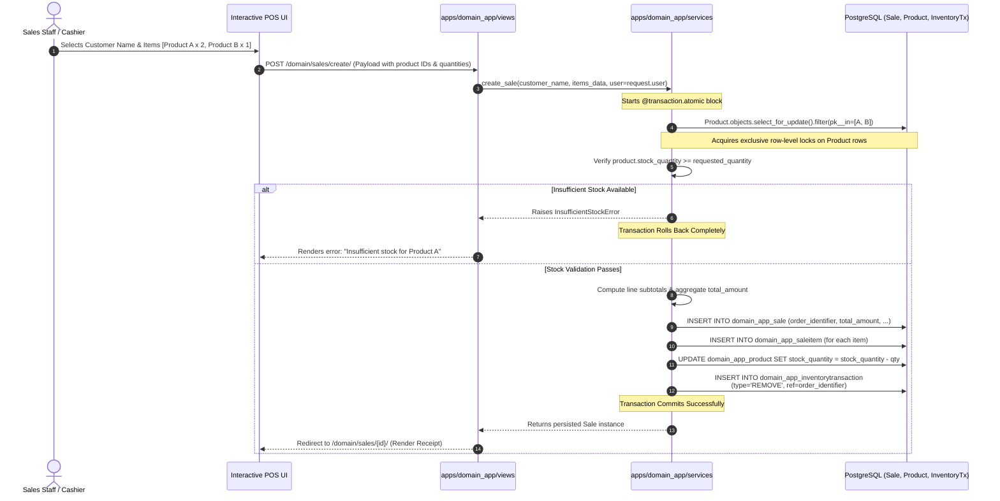
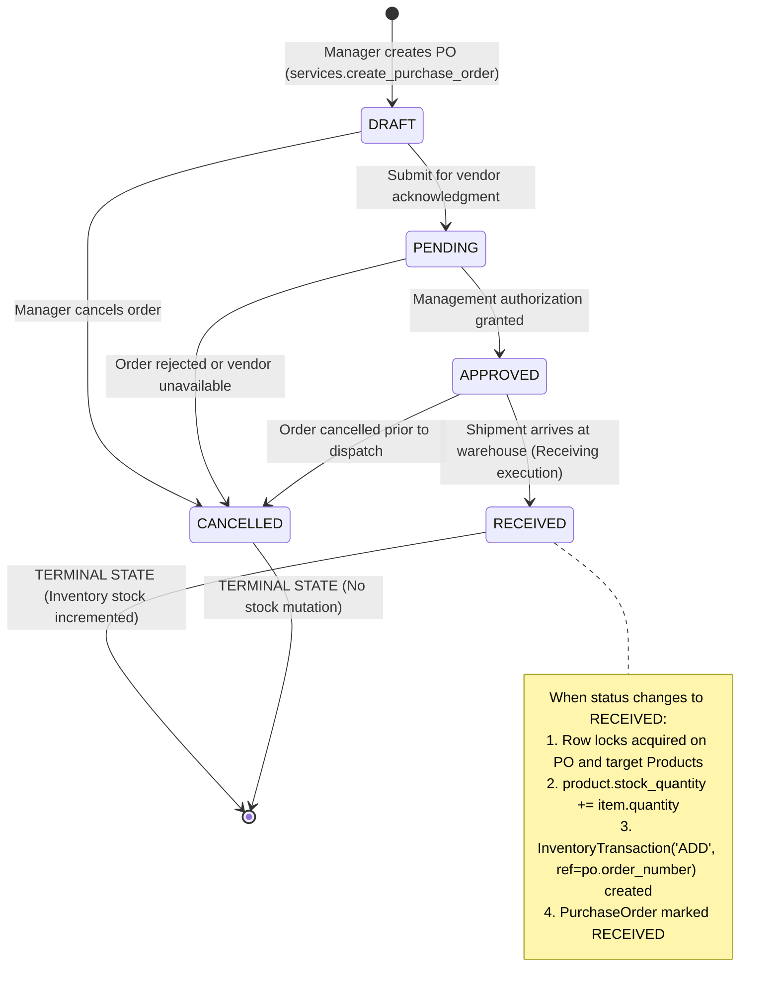
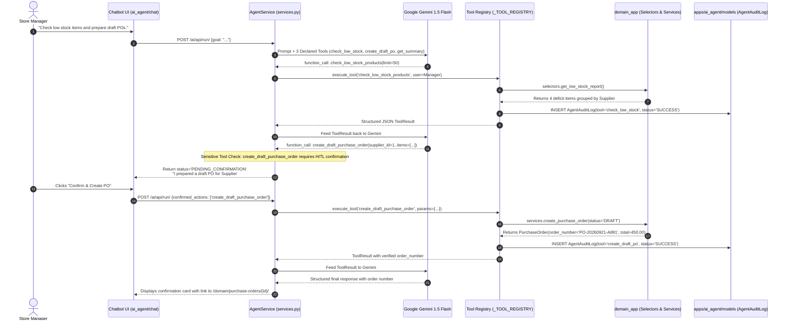
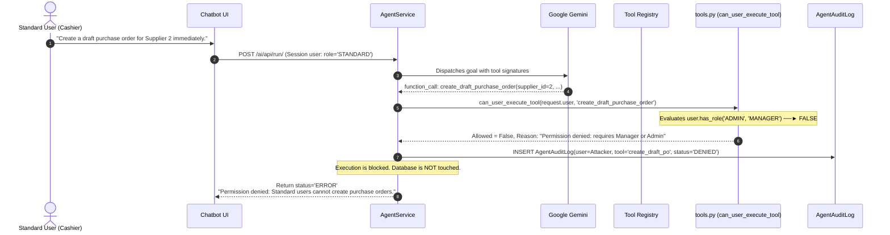

# End-to-End User Journey Specifications
## Small Business Inventory & Sales Management System (NexusERP)

---

## Overview

This document specifies the six authoritative operational journeys implemented in NexusERP. Each journey details the interaction sequence, backend validation logic, security checks, and database mutations.

---

## Journey 1 — User Registration, Authentication & Role Isolation

### Summary
A new user registers, is deterministically assigned the non-privileged `STANDARD` role, authenticates using salted password verification, and accesses the role-aware dashboard.

```mermaid
sequenceDiagram
    autonumber
    actor User
    participant Browser as Web Browser
    participant AuthView as apps/authentication/views
    participant UserForm as UserRegistrationForm
    participant DB as PostgreSQL (User Table)

    User->>Browser: Enters Username, Email, Password
    Browser->>AuthView: POST /auth/register/ (with CSRF token)
    AuthView->>UserForm: Bind POST data
    UserForm->>UserForm: Validate email uniqueness, password strength
    UserForm->>DB: INSERT User (role='STANDARD', is_staff=False)
    Note over UserForm,DB: Role assignment is hardcoded on server; user cannot self-promote.
    DB-->>AuthView: User record persisted
    AuthView->>AuthView: auth_login(request, user) [Issue HTTP-only Session Cookie]
    AuthView-->>Browser: Redirect to /auth/dashboard/
    Browser->>AuthView: GET /auth/dashboard/ (Session Cookie)
    AuthView->>DB: Fetch user role & live inventory KPIs
    AuthView-->>Browser: Renders personalized dashboard with 'Standard User' capabilities
```

### Key Security Assertions
- `role`, `is_staff`, and `is_superuser` are strictly excluded from registration forms.
- If an unauthenticated user attempts to access `/domain/products/create/`, they are redirected to `/auth/login/?next=/domain/products/create/`.
- If an authenticated `STANDARD` user accesses `/domain/products/create/`, the server returns **HTTP 403 Forbidden**.

---

## Journey 2 — Product Catalog Lifecycle Management

### Summary
A Manager creates a new inventory SKU, associating it with a Category and Supplier, triggering validation and an initial inventory ledger movement.

```mermaid
sequenceDiagram
    autonumber
    actor Manager as Store Manager
    participant Browser as Web Browser
    participant ProdView as apps/domain_app/views
    participant Decorator as @manager_required
    participant ProdService as apps/domain_app/services
    participant DB as PostgreSQL (Product, InventoryTx)

    Manager->>Browser: Fills Product Form (SKU, Name, Price, Initial Stock, Reorder Level)
    Browser->>ProdView: POST /domain/products/create/
    ProdView->>Decorator: Inspect request.user.role
    Decorator-->>ProdView: Role == 'MANAGER' (Access Granted)
    ProdView->>ProdService: create_product(sku, name, price, stock_quantity, ...)
    Note over ProdService: Starts @transaction.atomic block
    ProdService->>ProdService: Normalize SKU to uppercase; validate price >= 0.00
    ProdService->>DB: INSERT INTO domain_app_product
    opt Initial stock_quantity > 0
        ProdService->>DB: INSERT INTO domain_app_inventorytransaction<br/>(type='ADD', qty=stock_quantity, ref='INITIAL-STOCK')
    end
    Note over ProdService: Atomic Transaction Commits
    ProdService-->>ProdView: Returns persisted Product instance
    ProdView-->>Browser: Flash success message & Redirect to /domain/products/{id}/
```

### Key Business Invariants
- SKU uniqueness is enforced globally. Duplicate SKUs trigger immediate form errors.
- Database check constraints reject negative values for `price`, `stock_quantity`, or `reorder_level`.

---

## Journey 3 — Point-of-Sale Transaction Execution

### Summary
A sales representative executes a point-of-sale customer order. The backend serializes the stock decrement using database row locks, evaluates financial subtotals, and creates an immutable inventory audit record.



### Key Business Invariants
- Zero negative stock is strictly guaranteed via `select_for_update()` serialization and check constraints.
- Selling prices and computed subtotals are frozen in `SaleItem` to preserve historical integrity.

---

## Journey 4 — Purchase Order Procurement & Receiving Lifecycle

### Summary
A Manager manages replenishment stock from an initial Draft Purchase Order through to Receiving, which atomically increments physical inventory.



### Detailed Sequence for Receiving:
1. **Manager Action:** Clicks "Receive Order" on an `APPROVED` purchase order.
2. **Permission Check:** `@manager_required` confirms elevated role.
3. **Status Validation:** Engine asserts current status is `APPROVED` (orders cannot jump from `DRAFT` directly to `RECEIVED`).
4. **Supplier Active Check:** Inactive suppliers cannot receive status advancements.
5. **Atomic Stock Increment:** Each line item locks the corresponding `Product` row, increments `stock_quantity`, and generates an `InventoryTransaction` of type `ADD`.

---

## Journey 5 — Autonomous AI Replenishment Workflow

### Summary
A Manager instructs the AI Assistant to identify inventory shortages and draft purchase orders. The AI orchestrates allowlisted tools, reasons over structured deficits, pauses for human confirmation, and records an auditable execution trace.



### Critical Architectural Defenses Demonstrated:
- **No Direct DB Access:** Gemini never touches the database; all actions run through `domain_app` services.
- **Human-in-the-Loop (HITL):** Financial mutations pause until explicit user confirmation is submitted.
- **Anti-Hallucination:** The agent only confirms creation if the backend service returns a real `order_number`.

---

## Journey 6 — Unauthorized AI Mutation Attempt

### Summary
A standard cashier attempts to trigger an elevated mutation via the AI Chatbot. The backend security gateway intercepts the request, rejects execution, writes an audit record, and returns a safe error without touching the database.



### Key Security Assertions
- The LLM cannot grant permissions or bypass RBAC rules.
- `AgentAuditLog` records every unauthorized attempt with the offending user's identity and parameters for security auditing.
